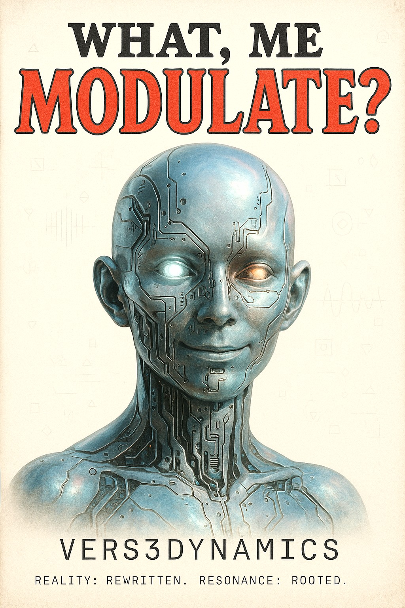

# Aethel ✨

> Transform your biometric essence into evolving audiovisual expressions

Aethel is a biometric resonance platform that captures real-time voice, facial, and ambient data to generate unique "Soul Prints" - personalized audiovisual signatures that represent your biometric essence.



## 🌟 Features

### Real-Time Biometric Capture
- **Voice Resonance**: Real microphone analysis of vocal patterns and harmonics
- **Facial Harmonics**: Live camera capture with facial expression analysis
- **Ambient Rhythms**: Environmental sound pattern detection

### Soul Print Generation
- Generate unique visual and audio signatures from biometric data
- Real-time visualization with cosmic-themed animations
- Harmonic frequency analysis and display
- Personalized biometric profiles

### Immersive UI/UX
- Cosmic-themed design with ethereal animations
- Responsive mobile-first interface
- Real-time feedback and visual indicators
- Engaging interactive elements with glow effects

## 🚀 Getting Started

### Prerequisites
- Node.js (v18 or higher)
- Modern web browser with camera/microphone permissions
- HTTPS connection (required for media device access)

### Installation

1. Clone the repository:
```bash
git clone <THIS_GIT_URL>
cd <THIS_PROJECT_NAME>
```

2. Install dependencies:
```bash
npm install
```

3. Start the development server:
```bash
npm run dev
```

4. Open [http://localhost:5173](http://localhost:5173) in your browser

### Permissions Required
- **Microphone**: For voice resonance capture
- **Camera**: For facial harmonics analysis
- **Audio Output**: For biometric sound synthesis

## 🎯 Usage

### Capturing Your Soul Print

1. **Choose Capture Mode**: Select between Voice Resonance, Facial Harmonics, or Ambient Rhythms
2. **Begin Capture**: Click "Begin Soul Capture" to start real-time biometric analysis
3. **Monitor Readings**: Watch your intensity, resonance, and harmonic frequencies in real-time
4. **Crystallize**: Click "Crystallize Soul Print" to generate your unique biometric signature

### Exploring the Gallery
- View curated Soul Prints from the community
- Browse affinity-based recommendations
- Explore your personal collection

### Profile Management
- Track your biometric evolution over time
- Analyze harmonic affinities
- Monitor collective impact metrics

## 🛠️ Technology Stack

- **Frontend**: React 18 + TypeScript
- **Styling**: Tailwind CSS with custom cosmic design system
- **UI Components**: shadcn/ui with Radix primitives
- **Audio Processing**: Tone.js for sound synthesis
- **Media Capture**: Web APIs (getUserMedia, Canvas, AudioContext)
- **Build Tool**: Vite
- **Backend**: Supabase (authentication, database, storage)

## 🎨 Design System

Aethel uses a cosmic-themed design system with:
- **Color Palette**: HSL-based cosmic colors (primary: purple, secondary: cyan, accent: turquoise)
- **Gradients**: Multi-layered cosmic gradients
- **Animations**: Soul pulse, harmonic waves, cosmic drift effects
- **Typography**: Thin, ethereal fonts with proper tracking

## 🔧 Development

### Available Scripts

```bash
npm run dev          # Start development server
npm run build        # Build for production
npm run preview      # Preview production build
npm run lint         # Run ESLint
```

### Project Structure

```
src/
├── components/          # React components
│   ├── ui/             # Reusable UI components
│   ├── capture-interface.tsx
│   ├── gallery.tsx
│   ├── navigation.tsx
│   └── profile.tsx
├── hooks/              # Custom React hooks
│   ├── use-audio-analyzer.ts
│   ├── use-camera-capture.ts
│   └── use-sound-synthesizer.ts
├── lib/                # Utility functions
├── pages/              # Page components
└── index.css          # Global styles & design system
```

### Key Components

- **CaptureInterface**: Main biometric capture interface
- **SoulPrint**: Animated visualization component
- **Gallery**: Community and personal Soul Print browser
- **Navigation**: Top navigation with cosmic styling

### Custom Hooks

- **useAudioAnalyzer**: Real-time audio frequency analysis
- **useCameraCapture**: Facial expression and metrics capture
- **useSoundSynthesizer**: Biometric sound generation

## 🎵 Audio Features

- Real-time frequency analysis
- Biometric sound synthesis
- Ambient soundscape generation
- Harmonic visualization
- Soul Print audio signatures

## 📱 Mobile Support

- Responsive design for all screen sizes
- Touch-optimized interactions
- Mobile camera and microphone access
- Performance optimized for mobile devices

## 🔒 Privacy & Security

- All biometric processing happens locally
- No data transmitted to external servers
- User permissions required for device access
- Data stored locally in browser

## 🤝 Contributing

1. Fork the repository
2. Create a feature branch: `git checkout -b feature/amazing-feature`
3. Commit your changes: `git commit -m 'Add amazing feature'`
4. Push to the branch: `git push origin feature/amazing-feature`
5. Open a Pull Request

## 📄 License

This project is licensed under the MIT License.

**Experience the cosmos within** ✨
